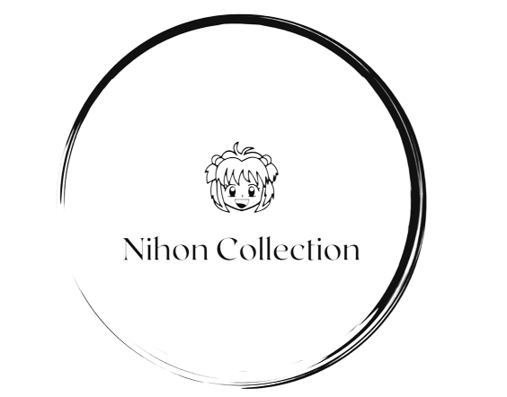
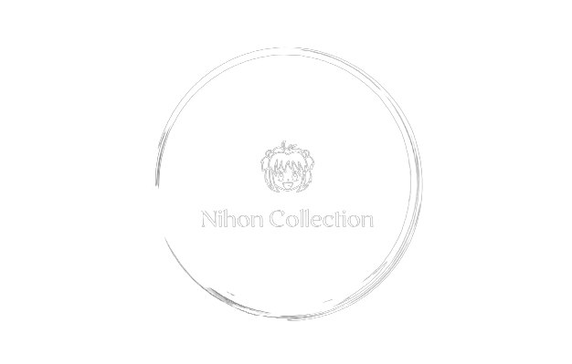
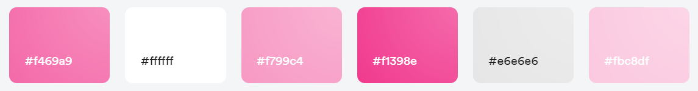
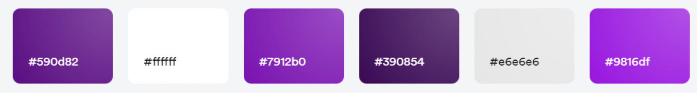

### ESIEE-IT - BTS SIO SLAM 2023 - AP n°3 Collector
#### NOM PROJET : Kitsu.io
#### OG Orcan, IMZILEN Abdelali, BONAMI Nirmala
#### version 1.0 le 24/05/2023

#### Logo "couleur" au format SVG ou au format PNG sur fond transparent  

#### Logo "noir" au format SVG ou au format PNG sur fond transparent  

#### Logo "blanc" au format SVG ou au format PNG sur fond transparent  

#### Palette de couleurs 
Version claire su site : 

Version sombre du site :

#### Polices de textes
Police de titres et police de texte : Callibri
Police de nom de personnages : 

#### Un set d'icônes (FontAwesome, Bootstrap Icons...)  

#### Choix des éléments
**LOGO**
Pour le logo, nous avons fait simple avec la tête d'un personnage générique pour rappeler l'univer des animes avec le nom de notre site en-dessous Nihon Collection.   

**NOM DU SITE**
Le japon est très connu dans le monde pour ses animes donc nous avons choisi le nom Nihon Collection pour note site web, Nihon qui veut dire Japon en japonnais et collection pour tous les animes et personnages accessible dans l'API choisie. 

**COULEURS**
Pour les couleurs, ce qui revient le plus dans les animes c'est le paysage floral avec les fleurs de cerisier donc la couleur principale et celle du logo est le rose.

#### Ressources
- Création du logo à l'aide du site looka.com  
- Test des couleurs avec Abobe Colors
